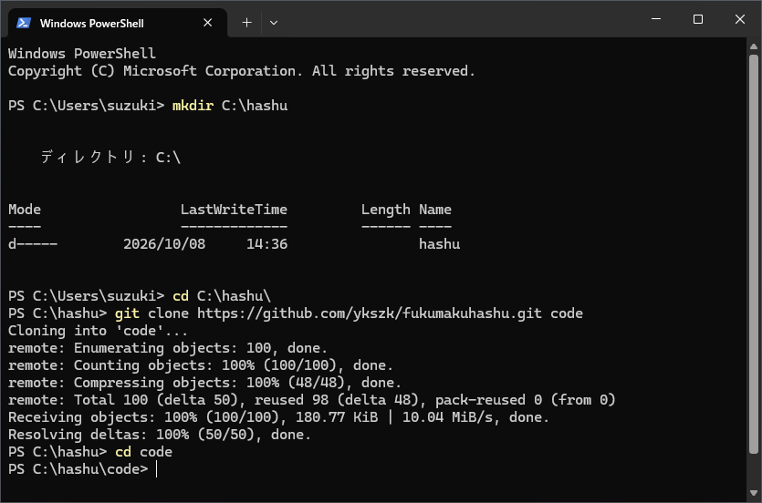
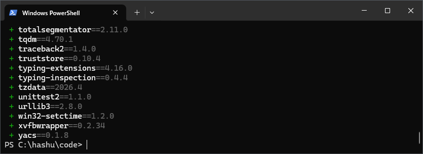
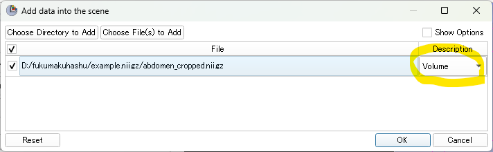
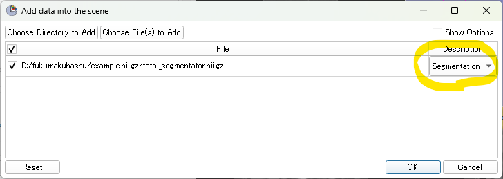
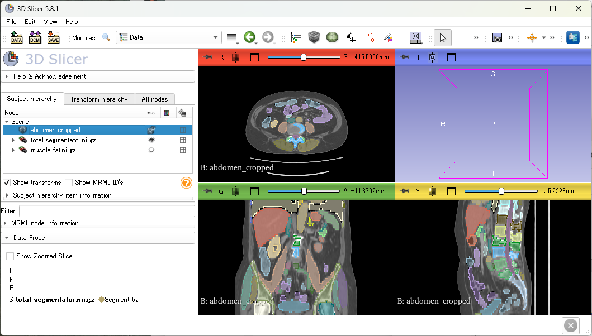

# 腹膜脂肪解析ツール 操作マニュアル

## このツールでできること

腹部CT画像を1件入力すると、腹腔内の脂肪（内臓脂肪）を見つけ、上部・中部・下部の3領域に分けて、それぞれを計測します。結果は、計測値の表と、目で確認するための画像として保存されます。

以下の処理を順番に自動で行います。

1. 臓器の抽出：臓器・骨・血管・筋肉など約117の構造を抽出します。約8～10分かかります。
2. 腹部の切り出し：肝臓の上端から仙骨の下端までのスライスだけを残します。
3. 脂肪の抽出：皮下脂肪、腹腔内の脂肪、筋肉を区別します。約2分かかります。
4. 領域分割：脂肪から臓器を除き、骨と肝臓を目印にして上部・中部・下部の3領域に分けます。
5. 確認画像の作成：各処理の結果を3方向の断面で示した画像を保存します。
6. 計測：各領域についてradiomics特徴量を計算します。脂肪の量によって2～50分かかります。

腹水を計測する別のツール（任意）もあります。後の章で説明します。

すべての処理はこのパソコン上で行われ、画像が外部に送られることはありません。ただし、初回はAIモデルをダウンロードするため、インターネット接続が必要です。

## 新しいパソコンでの初期設定（1回のみ）

初期設定には約30分かかり、パソコン1台につき1回だけ行います。必要なものは、Windowsパソコン、インターネット接続、TotalSegmentatorのライセンスキー（手順6）です。ツールと画像はすべて `C:\hashu` フォルダーに置きます。

初期設定では、コマンドをPowerShellに入力します（日々の解析はドラッグ＆ドロップだけで行えます）。PowerShellは、クリックの代わりに文字で指示を入力する画面です。開き方：Windowsキーを押し、`PowerShell` と入力してEnterキーを押します。コマンドを実行するには、このマニュアルからコピーしてPowerShellの画面に貼り付け（右クリックで貼り付け）、Enterキーを押します。カーソルが点滅して入力待ちに戻ってから、次のコマンドに進んでください。

1. **Gitをインストールする**：[git-scm.com/download/win](https://git-scm.com/download/win) からダウンロードしてインストーラーを実行し、すべての画面で「Next」をクリックして既定の設定のまま進めます。Gitは、プロジェクトとその部品の一部をインターネットから取得するのに使います。
2. **uvをインストールする**：uvは、Pythonとツールに必要なものをすべてインストールします。次のコマンドをPowerShellに貼り付けます。

   ```
   powershell -ExecutionPolicy ByPass -c "irm https://astral.sh/uv/install.ps1 | iex"
   ```
3. **PowerShellを閉じて、もう一度開く**：開き直さないと、PowerShellがGitとuvを見つけられません。
4. **プロジェクトをダウンロードする**：`C:\hashu` フォルダーを作り、その中の `code` フォルダーにツールをダウンロードします。

   ```
   mkdir C:\hashu
   cd C:\hashu
   git clone https://github.com/ykszk/fukumakuhashu.git code
   cd code
   ```

   

5. **ツールの部品をインストールする**：約100個の部品をダウンロードするため、数分かかります。

   ```
   uv sync
   ```

   `+` で始まる行の一覧が表示され、カーソルが戻れば完了です。

   

6. **ライセンスキーを登録する**：脂肪の抽出にはTotalSegmentatorのライセンスが必要です。学術利用であれば [backend.totalsegmentator.com/license-academic](https://backend.totalsegmentator.com/license-academic/) から無料で取得でき、メールで届きます。届いたら、`YOUR-KEY` をそのキーに置き換えて次を実行します。

   ```
   uv run totalseg_set_license -l YOUR-KEY
   ```

これでメインのツールは使える状態です。`C:\hashu` 内のフォルダーの名前や場所は変更しないでください。最初の解析時にはAIモデルのダウンロードも行われるため、初回のみ数分余分にかかります。腹水ツール（任意）の設定は、後の章で説明します。

## 画像を解析する

解析は、エクスプローラーで `C:\hashu\code` を開き、そこにあるbatファイルにフォルダーやファイルをドラッグ＆ドロップするだけです。1件には約15分～1時間かかりますす。解析は1件ずつ行ってください。

**フォルダー名とファイル名は半角英数字にしてください**（例：`001`）。日本語などの全角文字が入っていると解析できません。この名前が症例名になります。

1. **DICOMを `.nii.gz` に変換する**（inputフォルダに`症例名.nii.gz` ファイルがすでにある場合は不要）：DICOMファイルが入っているフォルダーの名前を症例名に変更し、`C:\hashu\code` の `to-niigz.bat` の上にドラッグ＆ドロップします。黒い画面が開き、「変換が終わりました」と表示されれば完了です。変換したファイルは `C:\hashu\dcm2niix` に保存され、このフォルダーが開きます。何かキーを押すと黒い画面が閉じます。

   フォルダーに複数のシリーズが入っている場合は、シリーズごとにファイルができます（`001_<シリーズ番号>_<シリーズ名>.nii.gz`）。
2. **解析するファイルを `C:\hashu\input` に移す**：`C:\hashu\dcm2niix` から解析するシリーズのファイルを1つ選び、`C:\hashu\input` に移します（`.nii.gz` ファイルがすでにある場合は、そのファイルを `C:\hashu\input` に置きます）。ファイル名が症例名になっていない場合は、`001.nii.gz` のような症例名に変更してください。どのシリーズを使うか迷う場合は、3D Slicerなどで画像を開いて確認します。`C:\hashu\dcm2niix` 内の不要なファイルは削除してかまいません。
3. **解析を開始する**：`C:\hashu\input` にある `.nii.gz` ファイルを、`C:\hashu\code` の `run_segmentation.bat` の上にドラッグ＆ドロップします。
4. **待つ**：各処理の進行状況が表示されます。画面は開いたままにし、パソコンがスリープしないようにしてください。画面を閉じると解析は止まります。
5. **完了を確認する**：「解析が終わりました」と表示されれば完了です。この表示より上の行に「Feature extraction failed!」が出ていないか確認してください。途中の処理が失敗しても、最後まで進むことがあります。

「解析が途中で止まりました」と表示された場合は、「困ったときは」を参照してください。症例ごとに結果フォルダーが分かれるため、以前の結果が上書きされることはありません。

## 結果の見方

各症例の結果は `C:\hashu\output\<症例名>` にあります。まず `segmentation_visualization.png` を開いて領域が正しいか確認し、そのあと `pyradiomics_features.csv` の数値を使います。

| ファイル | 内容 | 必要か |
| --- | --- | --- |
| `pyradiomics_features.csv` | 計測値（領域ごとに1行） | 必要：主な結果 |
| `segmentation_visualization.png` | 各処理の結果を3方向の断面で示した画像 | 必要：症例ごとに確認 |
| `pci_segmentation.nii.gz` | 脂肪の3領域（画像） | 画像ビューアーで見る場合 |
| `tissue_4_types.nii.gz` | 皮下脂肪、腹腔内の脂肪、筋肉 | 画像ビューアーで見る場合 |
| `total_segmentator.nii.gz` | すべての臓器・骨・血管 | 画像ビューアーで見る場合 |
| `abdomen_cropped.nii.gz` | 腹部だけを切り出した画像 | 腹水ツールの入力 |
| `abdomen_cropped_total_segmentator.nii.gz` | `total_segmentator.nii.gz` を腹部の範囲で切り出したもの（`abdomen_cropped.nii.gz` に重ねて表示できます） | 画像ビューアーで見る場合 |
| `remove.nii.gz` | 腹腔内の脂肪から除いた臓器・骨・血管などの領域 | 画像ビューアーで見る場合 |
| `pyradiomics_batch.csv` | 計測の途中で使う作業ファイル | 不要 |

### セグメンテーション結果の確認（必要な場合）

無料の画像ビューアー [3D Slicer](https://www.slicer.org/) で、結果をCT画像に重ねて確認できます。

1. **3D Slicerを起動する**
2. **CT画像を開く**：結果フォルダー（`C:\hashu\output\<症例名>`）内の `abdomen_cropped.nii.gz` を、3D Slicerの画面上にドラッグ＆ドロップします。表示されるダイアログの「Description」が「Volume」になっていることを確認して、「OK」をクリックします。

   
3. **セグメンテーション結果を開く**：同じフォルダー内の `abdomen_cropped_total_segmentator.nii.gz`（または `pci_segmentation.nii.gz`）を、画面上にドラッグ＆ドロップします。表示されるダイアログの「Description」を「Segmentation」に変更して、「OK」をクリックします。CT画像に結果が色付きで重なって表示されます。

   

   

## 任意：腹水の計測

腹腔内の液体（腹水）を抽出する別のツールです。メインの解析が終わった症例に対して、ドラッグ＆ドロップで実行します。

### 初期設定（1回のみ）

メインの初期設定のあとに行います。

1. **モデルファイルを入手する**：[NIHのダウンロードページ](https://nihcc.app.box.com/s/oc81mic9k8vre30fq0eanxqp9kdwern2)を開き、「Download」（ダウンロード）をクリックして `ascites_model.tar.gz`（約1.1 GB）をダウンロードします。ダウンロードしたファイルを `C:\hashu\downloads` フォルダーに移し、`C:\hashu\downloads\ascites_model.tar.gz` となるようにしてください（ブラウザーは通常、ユーザーの「ダウンロード」フォルダーに保存します）。`downloads` フォルダーがない場合は、先に手順2の `setup_ascites_model.bat` を実行すると、このフォルダーが作られ、ダウンロードページとフォルダーが開きます。このリンクは、腹水モデルの[プロジェクトページ](https://github.com/rsummers11/Ascites)に掲載されているものです。
2. **モデルを準備する**：エクスプローラーで `C:\hashu\code` を開き、`setup_ascites_model.bat` をダブルクリックします。モデルを展開し、腹水ツールの部品をインストールします（数分かかります）。「腹水ツールの準備ができました」と表示されれば完了です。そのあとは、`C:\hashu\downloads` 内の `ascites_model.tar.gz` を削除してかまいません。

### 実行

先にその症例のメイン解析を終わらせてください。そのあと、メイン解析で使ったのと同じ `.nii.gz` ファイル（または `C:\hashu\output` 内のその症例のフォルダー）を、`C:\hashu\code` の `run_ascites.bat` の上にドラッグ＆ドロップします。

「腹水の計測が終わりました」と表示されれば完了です。1件あたり約10分かかります。途中で表示される「postprocessing file」が見つからないという警告は想定どおりなので、無視してかまいません。結果の `ascites.nii.gz` はその症例の結果フォルダーに保存されます。腹水を示す画像なので、画像ビューアーで確認します。

## 困ったときは

ほとんどの問題は、同じファイルをもう一度ドラッグ＆ドロップすれば解決します。完了済みの処理は飛ばされ、止まったところから再開します。

| 表示・状況 | 対処 |
| --- | --- |
| 「全角文字が含まれていると解析できません」「全角文字が含まれています」 | フォルダー名やファイル名を半角英数字（例：`001`）に変更し、もう一度ドラッグ＆ドロップします。ファイルは `C:\hashu\input` に置いてください。 |
| 「同じ名前のファイルがすでにあります」 | 以前に同じ名前で変換済みです。そのファイルをそのまま使うか、不要なら `C:\hashu\dcm2niix` から削除して、もう一度実行します。別の症例なら、フォルダーを別の名前にします。 |
| 「変換できるDICOM画像が見つかりませんでした」 | DICOMファイルが入ったフォルダーか確認してください。 |
| 「フォルダーではありません」「.nii.gz ファイルではありません」 | ドロップ先を確認します。DICOMフォルダーは `to-niigz.bat` へ、`.nii.gz` ファイルは `run_segmentation.bat` または `run_ascites.bat` へドロップします。 |
| 「プログラムのフォルダーが見つかりません」 | ツールが `C:\hashu\code` にありません。初期設定の手順4を確認してください。 |
| 「'uv' is not recognized」など、`uv` または `git` が見つからない | パソコンを再起動します。それでも表示される場合は、そのインストール手順をやり直します。 |
| プロジェクトのダウンロード時にGitHubへのサインインを求められる | 非公開のプロジェクトです。プロジェクト管理者にアクセス権を依頼してください。 |
| 「It requires a license」と表示される | ライセンスキーを登録し（初期設定の手順6）、同じファイルをもう一度ドラッグ＆ドロップします。 |
| 「No GPU detected. Running on CPU. This can be very slow.」と表示される | 一般的な事務用パソコンでは正常です。時間はかかりますが、解析はできます。 |
| 解析中に画面を閉じた、またはパソコンがスリープ・再起動した | 同じファイルをもう一度ドラッグ＆ドロップします。最後に完了した処理の次から再開します。 |
| 「Feature extraction failed!」と表示される | 表の計測値が欠けます。画面の内容をプロジェクト管理者に送ってください。 |
| 失敗した処理を修正したのに、再実行するとその処理が飛ばされる | `C:\hashu\output` 内のその症例のフォルダーを削除してもう一度ドラッグ＆ドロップすると、最初からやり直せます。 |
| 確認画像で、色の付いた脂肪が臓器・骨・皮下にかかっている | その症例の数値は使わず、画像をプロジェクト管理者に送ってください。 |
| 「腹水モデルが見つかりません」 | 「任意：腹水の計測」の初期設定（手順1・2）を行ってください。setup_ascites_model.bat が「モデルの展開に失敗しました」「足りないファイルがあります」と表示する場合は、ダウンロードが途中で止まっています。ascites_model.tar.gz を削除してダウンロードし直してください。 |
| 「この症例のメイン解析の結果が見つかりません」 | 先に同じファイルを `run_segmentation.bat` にドロップして、メイン解析を終わらせてください。 |
| 「この症例の腹水の計測はすでに終わっています」 | 結果はすでにあります。やり直す場合は、その症例の結果フォルダー内の `ascites.nii.gz` を削除してから、もう一度ドロップします。 |

上記以外の場合は、黒い画面の内容をすべてコピーし（選択してEnterキーでコピー）、症例名を添えてプロジェクト管理者に送ってください。

## 使い方のまとめ

初期設定が済んでいれば、日々の作業はすべて、`C:\hashu\code` にあるbatファイルへのドラッグ＆ドロップです。フォルダー名とファイル名は半角英数字にしてください。

| やりたいこと | 操作 | 結果の場所 |
| --- | --- | --- |
| DICOMを変換する | DICOMフォルダーを `to-niigz.bat` にドロップ | `C:\hashu\dcm2niix\<フォルダー名>.nii.gz` |
| 解析するファイルを選ぶ | `C:\hashu\dcm2niix` からファイルを1つ `C:\hashu\input` に移す | `C:\hashu\input\<症例名>.nii.gz` |
| 脂肪を解析する | `.nii.gz` ファイルを `run_segmentation.bat` にドロップ | `C:\hashu\output\<症例名>` |
| 止まった解析を再開する | 同じファイルをもう一度 `run_segmentation.bat` にドロップ | 同上 |
| 腹水を計測する（任意、脂肪の解析のあと） | 同じ `.nii.gz` ファイルを `run_ascites.bat` にドロップ | `C:\hashu\output\<症例名>\ascites.nii.gz` |
